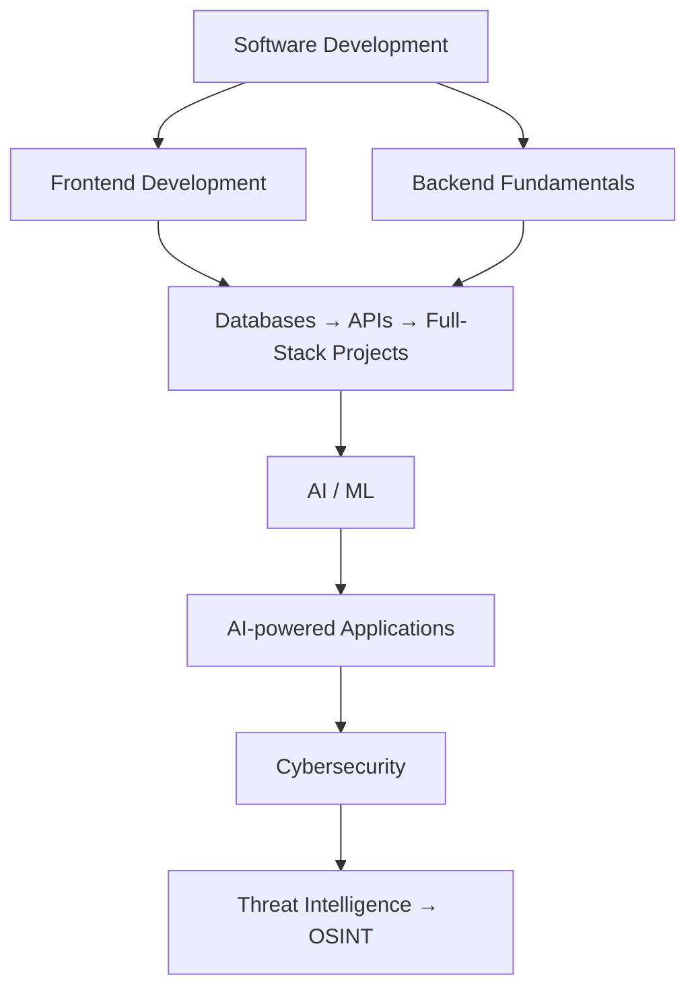

<div align="center">


<br/>

[](https://github.com/Mr-ParallaX)
[](https://github.com/Mr-ParallaX?tab=followers)
[](https://github.com/Mr-ParallaX)

</div>


## 🧑‍💻 About Me

```yaml
name: Faizan Jamkhandi
role: Computer Science Student
focus: Software & Web Development
exploring: [AI/ML, Cybersecurity, Threat Intelligence, OSINT]
mindset: "Learn → Build → Break → Debug → Understand → Improve"
current_status: developer in progress 🌱
```

I'm a Computer Science student focused on **software development and practical project building**, while continuously exploring **AI/ML and cybersecurity**.

I learn best by actually building things — from web applications and developer tools to cybersecurity projects and AI-powered experiments. I don't consider myself an expert. I'm a **developer in progress**, constantly learning, experimenting, and improving.

<table>
<tr>
<td valign="top" width="50%">

- 🎓 Computer Science student
- 💻 Interested in **Software & Web Development**
- 🤖 Exploring **AI/ML and AI-powered applications**
- 🔐 Exploring **Cybersecurity & Threat Intelligence**
- 🐍 Comfortable working with **Python**

</td>
<td valign="top" width="50%">

- 🌐 Building with **HTML, CSS, JavaScript**
- 🗄️ Working with **MySQL & PL/SQL**
- 🧩 Practicing **DSA and programming fundamentals**
- 🔧 Learning and using **Git & GitHub**
- 🚀 Building projects to turn concepts into experience

</td>
</tr>
</table>


## 🛠️ Tech Stack

<div align="center">

**Languages**


**Web & Development**


**Databases & Tools**


</div>

**Areas I'm Exploring**

<div align="center">


</div>

> **Current mindset:** I prefer understanding how things work instead of only making them work.


## 🚀 Featured Project

### 🛰️ ThreatMap — Threat Intelligence & OSINT Platform

A team-built cybersecurity project developed during my internship.

**ThreatMap** brings multiple security intelligence capabilities into one web platform. It works with indicators such as **IP addresses, domains, URLs and file hashes**, presenting security information in a more accessible interface.

<table>
<tr>
<td valign="top" width="50%">

**Platform Features**
- 🌐 IP threat mapping
- 🔎 IOC scanning and analysis
- 📊 Threat intelligence dashboards
- 🕸️ Network / relationship visualization
- 🤖 AI-assisted threat summaries

</td>
<td valign="top" width="50%">

**More Features**
- 📋 Watchlists and alerts
- 📦 Bulk IOC analysis
- 🔐 OSINT and historical scan info
- 🗄️ Shared database-backed scan results

</td>
</tr>
</table>

**My Contribution — Frontend**
- UI development and interface structure
- Reusable UI components
- Frontend logic and interactions
- Presenting security data clearly
- Connecting frontend flows with application data
- Improving usability across threat-analysis screens

<div align="center">

[](https://threat-map-test.vercel.app/)

</div>


## 📌 What I'm Currently Learning



My current goal isn't to learn every technology at once.

It's to **build stronger fundamentals, create better projects, and gradually become capable of developing complete applications independently.**


## 🎯 2026 Goals

- [ ] Build and deploy more complete full-stack applications
- [ ] Strengthen React and modern frontend development
- [ ] Improve backend and API development
- [ ] Go deeper into Python
- [ ] Strengthen DSA and problem-solving
- [ ] Learn more about AI/ML and practical AI applications
- [ ] Continue exploring cybersecurity and threat intelligence
- [ ] Contribute to open-source projects
- [ ] Build projects that solve real problems


## 📊 GitHub Activity

<div align="center">


</div>

<!--START_SECTION:waka-->
<!--END_SECTION:waka-->


## 🧠 My Learning Philosophy

<div align="center">

### `Learn → Build → Break → Debug → Understand → Improve`

</div>

I believe projects are one of the best ways to turn theoretical knowledge into practical skills.

Every project doesn't have to be perfect. It just needs to teach me something.


## 🤝 Let's Connect

I'm always interested in connecting with students, developers, builders, and people working on interesting ideas. If you're building something cool, learning something new, or want to collaborate on a project — feel free to reach out.

<div align="center">

<!-- Add your real links below. Remove any you don't use. -->
[](https://linkedin.com/in/YOUR_LINKEDIN)
[](https://twitter.com/YOUR_TWITTER)
[](https://instagram.com/YOUR_INSTAGRAM)
[](mailto:YOUR_EMAIL@gmail.com)

</div>


<div align="center">

### ⭐ Thanks for visiting my profile!

</div>
